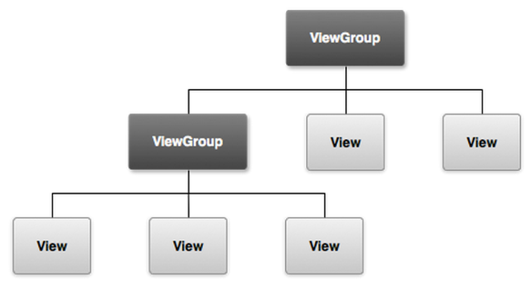
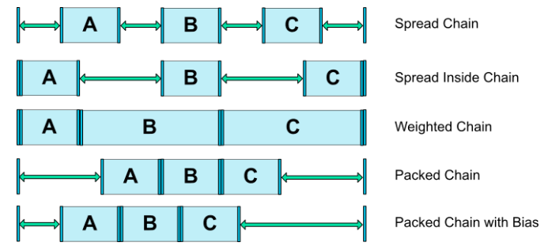

# Basics of Android layouts and views   
**STRUCTURE**
    

 

## What is a ViewGroup?
A viewgroup is a parent class of all the views. It holds all the children views (and viewgroups) within, as depicted by the structure above. 

## Types of ViewGroups
- **Absolute Layout**
    - By using an Absolute Layout, you can specify the exact locations (x/y coordinates) of its children.
    - They are less flexible and harder to maintain, rarely used nowadays.
    - One needs to remember too many coordinate values for placing a view at a position, it would rather be much easier to remember a view with respect to which one needs to place a view on screen. 
    
**Usage**  

        
        <AbsoluteLayout xmlns:android="http://schemas.android.com/apk/res/android"
            android:layout_width="fill_parent"
            android:layout_height="fill_parent">
            <Button
               android:layout_width="100dp"
               android:layout_height="wrap_content"
               android:text="OK"
               android:layout_x="50px"
               android:layout_y="361px" />
            <Button
               android:layout_width="100dp"
               android:layout_height="wrap_content"
               android:text="Cancel"
               android:layout_x="225px"
               android:layout_y="361px" />
        </AbsoluteLayout> 

 

- **Frame Layout**
    - It is usually used to block out an area on the screen and display only a single child on screen.
    - If multiple children are used within it then all the children are placed on top of each other.
    - Position of children can only be controlled by assigning gravity to them.
    - Usually used to display single fragments on screen. 

**Usage**  

        
        <FrameLayout xmlns:android="http://schemas.android.com/apk/res/android" 
            android:layout_width="match_parent"
            android:layout_height="match_parent">
   
            <ImageView 
               android:src="@drawable/ic_launcher"
               android:layout_height="250px"
               android:layout_width="250px"/>
            
            <TextView
               android:text="Frame Demo"
               android:layout_height="match_parent"
               android:layout_width="match_parent"
               android:gravity="center"/>
        </FrameLayout>

 

- **Linear Layout**
    - Aligns the children views either horizontally or vertically.
    - The attribute `android:orientation` specifies wheher to horizontally or vertically align children views.
    - We usually use the attribute `android:weight` in the children views/viewgroups to decide what percentage of the available space they should occupy.
    - An attribute `android:weightSum` defines the maximum weight sum, and is calculated as the sum of the `layout_weight` of all the children if not specified explicitly.  
        
        > **TRIVIA**: What would happen if the `weightSum` is less than the sum of weights given to children explicitly?  

 

- **Relative Layout**
    - Relative Layout enables you to specify how child views are positioned relative to each other.
    - The position of each view can be specified as relative to sibling elements or relative to the parent.  
        
        > Some common attribute usages in relative layout:
        - Difference between `android:layout_alignRight` and `android:layout_toRightOf` :
        `android:layout_alignRight` is used to align a view's rightmost edge to the rightmost edge of the specified view, whereas `android:layout_toRightOf` is used to place a view to the right of the specified view *ie* the left edge of a view is postioned to the right of the specified view.
        - Why to prefer `android:layout_toEndOf` instead of `android:layout_toRightOf`:
        The views have LTR(left-to-right) orientation by default *ie* they start from left and end towards their right, but this orientation can be changed to RTL(right-to-left) where views start from right and end towards left. In such cases, the views with the attribute `android:layout_toEndOf` will correctly align to the end w.r.t the view specified whereas `android:layout_toRightOf` will still align it towards the right.
    - Read more about Relative Layout [here](https://developer.android.com/guide/topics/ui/layout/relative.html) and [here](https://developer.android.com/reference/android/widget/RelativeLayout.html).  

        > **TRIVIA**: Relative Layout measures a view twice, whereas Linear Layout measures only once (if weights are not used)! 
        Sources: [Stack Overflow](https://stackoverflow.com/questions/4069037/is-a-relativelayout-more-expensive-than-a-linearlayout/17496262#17496262) and [Medium](https://medium.com/@vatsalbajpai/android-relative-layout-vs-linear-layout-f27bf3d8f74e)

 

- **PercentRelativeLayout**
    - Instead of specifying the width and height of a child, we can provide a percentage of screen width or height to use.
    - It is very useful in scaling layouts to various screen sizes.
    - The `PercentSupportLayout` supports two pre-built layout - `PercentRelativeLayout` and `PercentFrameLayout`.
    - Find an example for this [here](https://inthecheesefactory.com/blog/know-percent-support-library/en).

     

- **ScrollView**
    - It is a subclass of FrameLayout, as the name says it is used when your contents do not fit the screen and tend to overflow.
    - ScrollView can hold **only one** direct child. This means that you need to wrap all your views into a single viewgroup in order to use it within a ScrollView. 
    - ScrollView only supports vertical scrolling. Use `HorizontalScrollView` if you want to have horizontal scrolling.
    - It is advised **not** to use ScrollView with `ListView`, `GridView` and `Recycler View` as they take care of their own vertical scrolling.

 

- **Constraint Layout**
    - Constraint Layout is a new ViewGroup for android. The main motive of constraint layout is to design layouts which are flexible and look the same in all screen sizes.
    - The layout editor uses constraints to identify the position of a view on the screen.
    - The attributes like `android:layout_constraintTop_toTopOf`, `android:layout_constraintTop_toBottomOf` and other similar attributes are used to set constraints to views w.r.t. other views.
    - It supports **chaining** of views, using which the views can be easily positioned over a space, and works much better than using a combo of weights and gravity to achieve a configuration. The attributes `android:layout_constraintHorizontal_chainStyle` and `android:layout_constraintVertical_chainStyle` can be supplied various values to produce the following effects:  
          

  
    - Supports horizontal and vertical bias,by which we can tweak the positioning to favor one side over another using the bias attributes.  

    **Usage:** 
      

            <android.support.constraint.ConstraintLayout ...>
                <Button android:id="@+id/button" ...
                  app:layout_constraintHorizontal_bias="0.3"
                  app:layout_constraintLeft_toLeftOf="parent"
                  app:layout_constraintRight_toRightOf="parent/>
    - The above code produces a button like:  
       
    - It also provides a view called `Guideline` using which you can have an imaginary line (which is not a view) anywhere on the screen and position views according to it. You can position this guideline by providing it either a fixed value or a percentage value (w.r.t. the screen). 

- **Coordinator Layout**
    - CoordinatorLayout is a super-powered FrameLayout.
    - CoordinatorLayout is intended for two primary use cases:
       - As a top-level application decor or chrome layout
       - As a container for a specific interaction with one or more child views
    - By specifying Behaviors for child views of a CoordinatorLayout you can provide many different interactions within a single parent and those views can also interact with one another. View classes can specify a default behavior when used as a child of a CoordinatorLayout using the DefaultBehavior annotation.

## What is a List View?
- A list view is an adapter view that does not know the details, such as type and contents, of the views it contains. Instead list view requests views on demand from a `ListAdapter` as needed, such as to display new views as the user scrolls up or down.
- ListView attempts to reuse view objects in order to improve performance and avoid a lag in response to user scrolls. To take advantage of this feature, check if the convertView provided to `getView(...)` is null before creating or inflating a new view object(but this is not a default feature of listView, we have to implement it)

## What is a Recycler View?
- A flexible view for providing a limited window into a large data set.
- List View creates the view objects of all elements but Recycler View recycles those view objects which are not present at the screen.
- To implement Recycler View we have to make classes which extends `RecyclerView.Adapter<ViewHolder>` and `RecyclerView.ViewHolder` and then call `RecyclerView.setAdapter(Your Adapter)`.
- `ViewHolder` class will manage all the tasks related to instantiation of view objects and adapter will act as a bridge between Recycler View and View Holder.
    
## List View vs Recycler View
- **Reuses cells while scrolling up/down** - this is possible with implementing View Holder in the listView adapter, but it was an optional thing, while in the RecycleView it's the default way of writing adapter.
- **Decouples list from its container** - so you can put list items easily at run time in the different containers (linearLayout, gridLayout) with setting `LayoutManager`.
- **Animates common list actions** - Animations are decoupled and delegated to `ItemAnimator`.
    
## What is an Adapter and AdapterView?
- Whenever data is dynamic and is determined at runtime, we have to use an `AdapterView` like `ListView`, `GridView`, `Spinner` etc. to load views.
- An Adapter object acts as a bridge between an AdapterView and the underlying data for that view. 
- The Adapter provides access to the data items.
- The Adapter is also responsible for making a View for each item in the data set.

## What is a ViewHolder?
- It helps you to minimize the number of `findViewById()` calls by caching the results in a holder object.
- In case of ListViews and RecyclerViews, where a single layout file is used for all the views, it can be time consuming to access `findViewById()` again and again.
- `ViewHolder` can reduce this by providing a tag to each listItem so that you can immediately access them without the need to look them up repeatedly.

## Custom Views
- We can even create our custom views by extending the `View` class and using a combo of `Canvas` and `Paint`.

## Some general trivia
- Padding and Margin: 
    - `android:padding` attribute adjusts the position of a view's content from its borders internally.
    - `android:margin` attribute changes the distance of the borders of a view from its parent/view on which it depends.

- Gravity and LayoutGravity:
    - `android:layout_gravity` attribute is used to provide gravity (positioning w.r.t parent) to the entire view box.
    - `android:gravity` attribute is used to provide gravity to a view's contents, so that it is positioned accordingly within the view box.

- Baseline:
    - In a `RelativeLayout`, if you add `layout_alignBaseline` to a textView, the text in that view will scoot to align with the baseline of the specified element. The text from both elements will appear as if they were written on the same invisible line.
    - Have a look at an example [here](https://stackoverflow.com/questions/6447361/what-is-the-baseline-in-relativelayout)           
